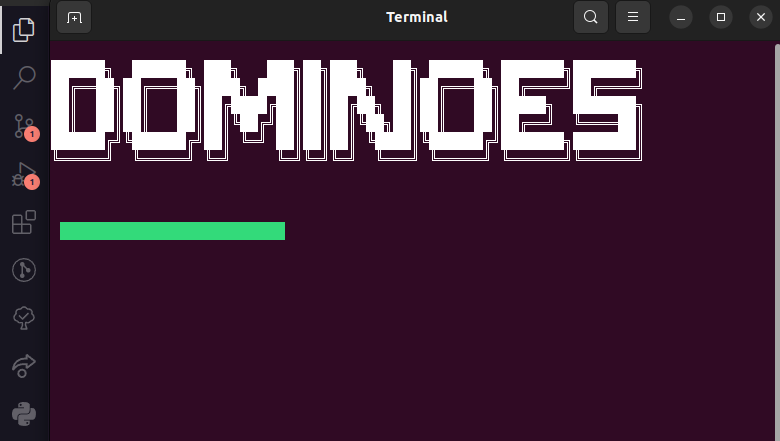
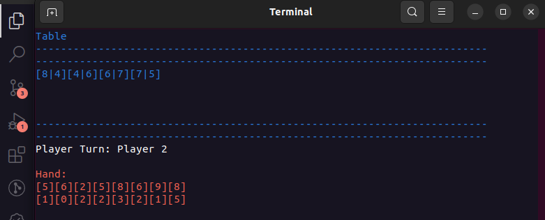
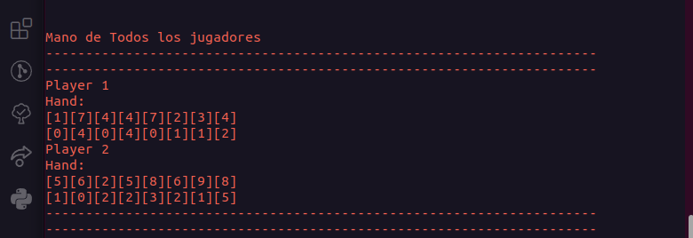

# Second_Project_Dominoes


***Proyecto de Programación II. Facultad de Matemática y Computación. Universidad de La Habana. Curso 2021.***

Dominoes es una aplicación que permite jugar Dominoes contra una serie de "inteligencias" *lo original* de esta aplicación es que hemos tratado de crear código de manera que implementar una nueva variante de domino o una nueva inteligencia requiera de la menor cantidad de cambios posibles.

Es una aplicación de Consola, desarrollada con tecnología .NET Core 6.0 y en el lenguaje C#.

La aplicación está dividida en dos componentes fundamentales:

- `VisualDominoes` es un aplicación de consola que renderiza la interfaz gráfica y sirve los resultados.
- `DominoEngine` es una biblioteca de clases donde está implementada lo necesario para la lógica del del juego.

# Sobre el Juego
## Manual de Usuario

El Juego comienza con una presentación luego deberá modelar el juego mediante una serie de elecciones

**Primera Elección:**

Debe seleccionar uno de los números de al lado para elegir la variante del domino (Ejemplo: 2 para la versión doble 9)

- 0 Doble 7 
- 1 Doble 8
- 2 Doble 9
- 3 Doble 10

**Segunda Elección:**

Debe elegir la cantidad de jugadores

**Tercera Elección:**

La cantidad de fichas por jugador

**Cuarta Elección:**

Tipo de juego (Consta con tres variaciones de domino)

- 0 Classic Dominoes (Domino Clásico)
- 1 Pretty Boy (Domino de figuritas)
- 2 Sloten (Domino Robaito)

**La Quinta Elección:**

Seleccionar el tipo de player que jugara; cada vez que seleccione un jugador este le pedirá un identificador o nombre

- 0 Human Player (Para que el usuario pueda jugar)
- 1 Ramdom Player (Jugador Ramdom)
- 2 Drop Fat Player (Botagordas)
- 3 Almost Clever Player (Casi Inteligente :))

**Luego que halla seleccionado conformado el juego comenzara el el juego**
>La parte visual se compone de dos partes una que muestra la mesa y la mano del jugador actual y otra que muestra la mano de todos los jugadores




# **Analisis de proyecto**
El proyecto cuenta de una estructura ficha que esta de compuesta de dos valores,que podemos hacer variar, cuando variamos el valor podemos tener fichas de figuras,colores,números etc... Tiene una clase mesa que almacena las fichas que serán jugadas. Contiene una clase jugador con una lista de fichas, y una estrategia que se le pasa al constructor,esta determina como jugara este "random ,"bota-gordas".
Tenemos la clase reglas, que determinan un conjunto de utilidades. Ejemplo: Comprueba si es el turno de un jugador , si hay final, si existe un ganador,si hay empate,si una jugada es valida y genera las fichas. Las reglas del juego son modeladas a través de las clases que implementan condiciones de finalización y de ganador,que se les pasan en el constructor, lo cual nos permite hacer variar en parte como se desarrolla la partida. Las Clases que implementan GameLogic tienen métodos que permiten cambiar de jugador, a uno valido (Busca al jugador que le toca, si este no puede jugar, lo pasa ,cambia el turno y repite el proceso hasta encontrarlo), contiene un método que desarrolla el proceso del turno actual (Pedirle al jugador actual una jugada,añadir a la mesa,quitarla de la mano y pasar turno). Esto no se desarrolla de forma igual en todos los juegos, por eso lo consideramos como un aspecto a variar en la construcción de una nueva lógica de juego,en otras variantes como el robaito este método modela algunos cambios, como es la cuestión de que si el jugador no lleva, roba hasta que pueda jugar. Hay un método que dice si hay final lo cual es determinado por las reglas que sean pasadas a la lógica de juego,otro método que nos pareció necesario variar fue la forma de repartir las fichas.
El juego se desarrolla repitiendo un ciclo. Buscar un jugador valido, preguntar si hay final, desarrollar lo que pasa en el turno actual y repetir hasta que se termina el juego luego tenemos un ganador o un empate.  

# **Sobre la ingeniería de software**

**Para implementar la lógica del los juegos hemos implementado varias varias interfaces fundamentales:**

```cs
public interface IEndCondition<TValue, T> where TValue :IValue<T>
{
    public bool IsFinal(List<Player<TValue, T>> players);
}
```
> Quien implemente la interfaz deberá implementar un método que servirá de condición de finalización esto nos permitirá crear variaciones de las misma. Recibe una lista de jugadores y devuelve ***`true`*** si se cumple determinada condición

**Ejemplo de Clase que implementa la interface:**
```cs
public class IsLocked<TValue, T> : IEndCondition<TValue, T> where TValue : IValue<T>
    {
        public bool IsFinal(List<Player<TValue, T>> players)
        {
            foreach (var item in players)
            {
                if (!item.Pass) return false;
            }
            return true;
        }
    }
```
> `IsLocked` implementa la condición de finalización de un juego trancado y esto pasa cuando todos los jugadores están pasados

```cs
public interface IWinCondition<TValue,T> where TValue : IValue<T>
{
    public bool IsWinner(Player<TValue,T> player,List<Player<TValue,T>> players);
}
```
> Quien implemente la interfaz deberá implementar un método que servirá de condición para determinar si un jugador es ganador y permitirá crear distintas formas en las que un jugador gana por ejemplo en un juego donde las fichas tiene caras contables como números una posible forma de ganar puede ser por cantidad de puntos el que mas tenga gana en una variante donde las caras son figuras o colores una posible condición de ganar es el jugador que primero se quede sin fichas. El método Recibe un jugador y una lista de jugadores y devuelve ***`true`*** si se cumple determinada condición.

**Ejemplo de Clase que implementa la interface:**
```cs
  public class WinnerByChips<TValue, T> : IWinCondition<TValue, T> where TValue : IValue<T>
    {
        public bool IsWinner(Player<TValue, T> player, List<Player<TValue, T>> players)
        {
            return (player.NumChips == players.Min(x => x.NumChips));
        }
    }
```
> WinnerByChips implementa un criterio de ser ganador basado en la cantidad de fichas si el jugador que se le pasa es el que menor cantidad de fichas tiene entonces este puede ser un posible ganador 

> `Nota:`Las condiciones de ganador y de finalización se conjuntan para buscar el estado de finalización del juego. No implementamos simplemente una condición de finalización porque nos parecía atractiva la idea para mejoras y extensión del proyecto que el jugador usando condiciones de ganador pudiera "ganar" algo por determinadas acciones independientes al fin. Ejemplo ganar 5 puntos cada vez que el próximo jugador se pase esto es a criterio de la variante de domino que se desea implementar.

```cs
public interface IValue<T> : IEquatable<IValue<T>>
{
    public T? Value { get; }
}
```
>`IValue` esta interface tiene un parámetro genérico ***Value*** que básicamente es el valor de una de las caras de las fichas estas interface implementa `IEquatable<IValue<T>>` que me permite determinar si dos `IValue` son iguales.

```cs
public interface IRankable: IComparable<IRankable>
{
    public int Rank();
}
```
>`IRankeble` esta creado con el objetivo de que sea implementado por un objeto que representa la cara de una ficha este deberá implementar un método `Rank()` que asignar un racking (que tan grande es ese valor) la utilidad de esto es que permitirá hacer que un jugador bota-gorda pueda jugar con tipos de Values no numéricos

**Ejemplo de Clase que implementa la interface:**

```cs
public class Emojis : IValue<string>, IRankable
{
    public Emojis(string value)
    {
        Value = value;
    }

    public bool Equals(IValue<string>? other)
    {
        return object.Equals(this, other);
    }

    public int Rank()
    {
        return ((short)Value[0]);
    }

    public int CompareTo(IRankable? other)
    {
        if (this.Rank() == other.Rank()) return 0;
        if (this.Rank() < other.Rank()) return -1;
        return 1;
    }
}
```
>Esta clase fue creada para representar una de las cara de la ficha solo podrá mostrase en Ubuntu debido a que fue creada para almacenar emojis y estos no se visualizan en la consola de Windows esta clase implementa `IValue<string>`, `IRankable` esto nos da una estructura que el valor es lo que mostrara como cara y Rank devuelve un valor que permite comparar los valores de las caras 

```cs
public interface IStrategy<TValue, T> where TValue : IValue<T>
{
    public bool ValidMove(Player<TValue, T> player,Board<TValue, T> board, Rules<TValue, T> rules,out(Chip<TValue, T>,TValue) move);
}
```
> Quien implementa la interface `IStrategy` debe implementar método que definirá la forma en que un jugador se juega por ejemplo un jugador que juega las fichas con preferencia de la mayor se conoce como bota-gorda. Se le pasa un jugador,la mesa y las reglas y este devuelve como salida principal la si el jugador puede jugar y como salida secundaria usando el `out:` una tupla que en la primera posición devuelve la ficha que jugara y en la segunda la cara por donde  jugar la ficha,

```cs
public interface IGameLogic<TValue,T> where TValue:IValue<T>
{
int Turn { get; } // Turno Actual del juego
Board<TValue, T> board { get; } //Una Mesa
List<Player<TValue, T>> Players { get; }//Lista de Jugadores
Rules<TValue, T> Rules { get; }//Las reglas del juego
List<Chip<TValue, T>> Chips { get; }//Las fichas
Player<TValue, T>? CurrentPlayer { get; }//Un Jugador Actual;
//Un método que busca en la lista un jugador que pueda jugar y hace el proceso de pasar el turno y declarar al jugador como pasado si a este le toca y no puede jugar
void ChangeValidCurrentPlayer();
//Ejecuta las cosas que debe parar en el turno del jugador actual
void CurrentTurn();
//Dice si el Juego se termino
bool EndGame();
//Reparte de un numero de fichas a cada jugador
void HandOutChips(int CountChip);
}
```
>`IGameLogic` permite implementar lógicas de juegos muy distintas una de la otra esta consta de parámetros que conforman el juego y cuatro métodos que determinan el desarrollo de un juego;

> El resto de las clases implementan estas interface para crear distintos criterios para la conformación de un juego

# **Clases que no implementan interfaces** ***(no consideramos necesario la variación de ellas de forma absoluta)***

##  Class Player
```cs
public class Player<TValue, T> where TValue : IValue<T>
    {
        // Estrategia que implementa el jugador
        protected IStrategy<TValue, T> Strategy;
        // Estado del jugador si se paso o no 
        public bool Pass { get; set; }
        // Identificador del jugador
        public string Name { get; protected set; }
        // Lista de fichas que tiene el jugador en la mano
        protected List<Chip<TValue, T>> HandChip;
        // Orden del jugador ejemplo 3er jugador
        public int PlayerOrder { get; protected set; }
        // Numero de fichas
        public int NumChips { get { return HandChip.Count; } }
        //Constructor 
        public Player(string name, int playerOrder, IStrategy<TValue, T> strategy)
        // Se le pasa la mano al jugador
        public void TakeHandChip(List<Chip<TValue, T>> HandChip)
        // Agrega una ficha a la mano
        public void TakeChip(Chip<TValue, T> chip)
        // Devuelve la mano 
        public List<Chip<TValue, T>> GetHand()
        // Devuelve la ficha en la posición que se le entra
        public Chip<TValue, T> GetChipInPos(int pos)
        // Elimina una ficha de la mano
        public void PlayChip(Chip<TValue, T> chip)
        // Determina si el jugador tiene fichas en la mano con las que pueda jugar
        public bool CanPlay(Board<TValue, T> board, Rules<TValue, T> rules)
        {
            foreach (var chip in HandChip)
            {
                if (rules.PlayIsValid(chip, board.GetLinkL) || rules.PlayIsValid(chip, board.GetLinkR))
                {
                    return true;
                }
            }
            return false;
        }
        // Devuelve una lista con todas las posibles fichas que el jugador puede poner
        public List<Chip<TValue, T>> GetValidPlay(TValue value, Rules<TValue, T> rules)
        {
            List<Chip<TValue, T>> chips = new List<Chip<TValue, T>>();
            foreach (var chip in HandChip)
            {
                if (rules.PlayIsValid(chip, value))
                {
                    chips.Add(chip);
                }
            }
            return chips;
        }
        // Encapsula la estrategia del jugador
        public bool NextPlay(Board<TValue, T> board, Rules<TValue, T> rules, out (Chip<TValue, T>, TValue) move)
        {
            return Strategy.ValidMove(this,board, rules, out move);

        }
    }
}
```

## Class Rules

```cs
public class Rules<TValue, T> where TValue : IValue<T>
    {
        //Colección de condiciones para determinar un Ganador
        ICollection<IWinCondition<TValue, T>> WinConditions;
        //Colección de condiciones para determinar si hay fin del juego
        ICollection<IEndCondition<TValue, T>> FinalCondition;

        //Constructor
        public Rules(ICollection<IWinCondition<TValue, T>> winConditions, ICollection<IEndCondition<TValue, T>> finalCondition)
       
        //Determina si una jugada es valida se le pasa una ficha y una cara y devuelve true si esa ficha se puede jugar
        public bool PlayIsValid(Chip<TValue, T> chip, TValue value)
        {
            return chip.LinkL.Equals(value) || chip.LinkR.Equals(value) || value == null;
        }
        // Se usa para verificar si es el turno de un jugador
        public bool IsTurnToPlay(int turn, int NumPlayers, int playerOrder)
        {
            return turn % NumPlayers == playerOrder;
        }
        // Generador de fichas de domino se le pasa la cantidad de caras y genera las fichas ejemplo construye las fichas para la variante doble 9
        public List<Chip<TValue, T>> GenerateChips(int cant, TValue[] values)
        {
            List<Chip<TValue, T>> Chips = new List<Chip<TValue, T>>();
            for (int i = 0; i < cant; i++)
            {
                for (int j = i; j < cant; j++)
                {
                    Chips.Add(new Chip<TValue, T>(values[i], values[j]));
                }
            }
            return Chips;
        }
        // Evalúa todas las condiciones de finalización y determina si se cumple alguna
        public bool IsFinal(List<Player<TValue, T>> players)
        {
            bool isFinal = false;
            foreach (var finalCondition in FinalCondition)
            {
                isFinal = isFinal || finalCondition.IsFinal(players);
            }
            return isFinal;
        }
        // Determina si hay un empate determinado si existen mas de un jugador que cumplen las condiciones de ganador
        public bool IsTie(List<Player<TValue, T>> players, out  List<Player<TValue, T>> winners)
        {
            List<Player<TValue, T>> playersWinners = new();
            foreach (var winCondition in WinConditions)
            {
                foreach (var player in players)
                {
                    if (winCondition.IsWinner(player, players))
                    {
                        if (!playersWinners.Contains(player))
                        {
                            playersWinners.Add(player);
                        }
                    }
                }
            }
            if(playersWinners.Count > 1)
            {
                winners = playersWinners;
                return true;
            }
            winners = playersWinners;
            return false;
        }
        // determina si un jugador gano
        public bool IsWinner(List<Player<TValue, T>> players, out Player<TValue, T> player)
        {
            List<Player<TValue, T>> playerWin;
            if(!IsTie(players,out playerWin))
            {
                if(playerWin.Count == 1)
                {
                    player = playerWin[0];
                    return true;
                }
            }
            player = default(Player<TValue, T>);
            return false;
        }
    }
```
# Análisis completo de la lógica de una variante de domino

## Domino Clasico

```cs
 public class ClassicGameLogic<TValue, T> : IGameLogic<TValue, T> where TValue : IValue<T>
    {
        // Turno actual del juego
        public int Turn { get; private set; }
        // Mesa
        public Board<TValue, T> board { get; }
        // Lista de jugadores
        public List<Player<TValue, T>> Players { get; private set; }
        // Reglas del juego
        public Rules<TValue, T> Rules { get; }
        // Lista de todas las fichas del juego
        public List<Chip<TValue, T>> Chips { get; }
        // Jugador actual
        public Player<TValue, T>? CurrentPlayer { get; private set;}
        //Constructor
        public ClassicGameLogic(int countLinkedValues, Rules<TValue, T> rules, TValue[] linkedValues, List<Player<TValue, T>> players)
        {
            Turn = 0;
            board = new Board<TValue, T>();
            Players = players;
            Rules = rules;
            Chips = Rules.GenerateChips(countLinkedValues, linkedValues);
            this.CurrentPlayer = Players[0];
        }
        // Reparte un numero de fichas de forma Random como en el domino clásico
        public void HandOutChips(int CountChip)
        {
            Random var = new Random();
            List<Chip<TValue, T>> Randomized = Chips.OrderBy(Item => var.Next()).ToList<Chip<TValue, T>>();
            for (int i = 0; i < Players.Count; i++)
            {
                List<Chip<TValue, T>> PlayerHand = new List<Chip<TValue, T>>();
                for (int n = 0, j = 0; n < CountChip; n++)
                {
                    PlayerHand.Add(Randomized[i * CountChip + j++]);
                }
                // Se las pasa al jugador I-esimo de la lista
                Players[i].TakeHandChip(PlayerHand);
            }
        }

        // Busca el próximo jugador valido y actualiza el currentPlayer y los turnos
        public void ChangeValidCurrentPlayer()
        {
            Player<TValue, T> currentPlayer;
            // Recorre todos los jugadores
            for (int i = 0; i < Players.Count; i++)
            {
                // recorre buscando de quien es el turno
                foreach (var player in Players)
                {
                    // Busca de quien es el turno
                    if (Rules.IsTurnToPlay(Turn, Players.Count, player.PlayerOrder))
                    {
                        currentPlayer = player;
                        //pregunta si puede jugar si puede actualiza el current 
                        if (player.CanPlay(board, Rules))
                        {
                            CurrentPlayer = currentPlayer;
                            player.Pass = false;
                            return;
                        }
                        //Si no puede lo pasa y busca al siguiente jugador 
                        else
                        {
                            player.Pass = true;
                            break;
                        }
                    }
                }
                //pasa el turno cada vez que pasa a un jugador porque no ha encontrado un jugador que pueda jugar
                Turn++;
            }
            CurrentPlayer = null;
        }
        // Acciones del turno actual
        public void CurrentTurn()
        {
            //Le pide una jugada al currentPlayer
            bool canPlay = CurrentPlayer.NextPlay(board, Rules, out (Chip<TValue, T>, TValue) playerMove);
            if (canPlay)
            {
                //si pudo jugar la pone en la mesa
                board.AddChip(playerMove);
                // le quita la ficha de le mano al jugador
                CurrentPlayer.PlayChip(playerMove.Item1);
                // pasa el turno
                Turn++;
            }
        }
        // determina si hay fin en el juego
        public bool EndGame()
        {
            return Rules.IsFinal(Players);
        }
    }
```
# Analisis de la parte visual

```cs
public class ControllerGame
    {
        TValuesContents Values = new();
        public void MakeGame()
        {
            InterPrints.Front();
            while (true)
            {   
                 //--------------------------------------------------------------------------------------------------------
                //--------------------------------------------------------------------------------------------------------
                //Bloque de construcción del juego
                ICollection<string> versionDominoes = Enum.GetNames(typeof(VersionDomioes));
                int selectCountChip = InterPrints.PrintSelect(versionDominoes, "Domino Version", versionDominoes.Count);
                int countLinkedValues = InterPrints.VersionChips(selectCountChip);
                int countPlayer = InterPrints.PrintSelect(new List<string>(), "Amount of players", countLinkedValues);
                int maxNumChip = ((countLinkedValues * (countLinkedValues + 1)) / 2) / countPlayer;
                int numChipForPlayer = InterPrints.PrintSelect(new List<string>(), "Amount of chips in hand", maxNumChip + 1);

                ICollection<string> typesGames = Enum.GetNames(typeof(TypeGame));
                int selectTypeGame = InterPrints.PrintSelect(typesGames, "Game type", typesGames.Count);
                TypeGame typeGame = (TypeGame)selectTypeGame;
                //--------------------------------------------------------------------------------------------------------
                //--------------------------------------------------------------------------------------------------------
                switch (typeGame)
                {
                    case TypeGame.ClasicDominos:
                        {   
                        //--------------------------------------------------------------------------------------------------------
                        //--------------------------------------------------------------------------------------------------------
                            //Bloque de construcción del juego
                            List<Player<Numeric, int>> players = new();
                            ICollection<string> typePlayer = Enum.GetNames(typeof(TypePlayer));

                            for (int i = 0; i < countPlayer; i++)
                            {
                                int selectTypePlayer = InterPrints.PrintSelect(typePlayer, "Player type", typePlayer.Count);
                                InterPrints.AddPlayer(players, selectTypePlayer, i);
                            }
                            IWinCondition<Numeric, int>[] winConditions = { new WinnerByPuntos<Numeric, int>(), new PlayAllChips<Numeric, int>() };
                            IEndCondition<Numeric, int>[] finalConditions = { new IsLocked<Numeric, int>(), new PlayAllChips<Numeric, int>() };
                            Rules<Numeric, int> rules = new(winConditions, finalConditions);
                            ClassicGameLogic<Numeric, int> gameLogic = new(countLinkedValues, rules, Values.ValuesNumerics, players);
                        //--------------------------------------------------------------------------------------------------------
                        //--------------------------------------------------------------------------------------------------------
                            // Echa a andar el juego 
                            NewGame<Numeric, int>(gameLogic, numChipForPlayer);
                            break;
                        }
                    case TypeGame.PrittyBoy:
                        {
                            //Acá pasa similar al case anterior según la elección construimos el juego y lo ejecutamos
                        }
                    case TypeGame.Stolen:
                        {
                            //Acá pasa similar al case anterior según la elección construimos el juego y lo ejecutamos
                        }
                }
                int key = InterPrints.PrintSelect(new string[] {"New Game","Exit" }, "Desea Continuar?", 2);
                if(key == 1) return;
            }

        }
        public void NewGame<TValue, T>(IGameLogic<TValue, T> Game, int numChipPlayer) where TValue : IValue<T>
        {

            //Genera las fichas
            Game.HandOutChips(numChipPlayer);

            do
            {   //Busca al jugador actual(al que le toca y no esta pasado y pasa y pasa de turno si al jugador que le toca no puede jugar
                // Básicamente busca a quien puede jugar  )
                Game.ChangeValidCurrentPlayer();
                //Pregunta si ya se acabo el juego
                if (Game.EndGame())
                {
                    break;
                }
                //-----------------------------------------------------------------------------------------
                //-----------------------------------------------------------------------------------------
                //Bloque de impresiones
                InterPrints.PrintGame(Game);
                InterPrints.PrintHand(Game.CurrentPlayer.GetHand());
                Console.WriteLine("\n");
                Console.WriteLine("Mano de Todos los jugadores");
                Console.WriteLine("---------------------------------------------------------------------");
                Console.WriteLine("---------------------------------------------------------------------");
                foreach (var player in Game.Players)
                {
                    Console.WriteLine(player.Name);
                    InterPrints.PrintHand(player.GetHand());
                }
                Console.WriteLine("---------------------------------------------------------------------");
                Console.WriteLine("---------------------------------------------------------------------");
                //-----------------------------------------------------------------------------------------
                //-----------------------------------------------------------------------------------------
                
                //ejecuta todo lo que pasa en un turno
                Game.CurrentTurn();
                Console.ReadKey();
               

            } while (true);
            // busca si hay un ganador
            if (Game.Rules.IsWinner(Game.Players, out Player<TValue, T> winner))
            {
                Console.WriteLine("The winner is " + winner.Name);
            }
            //busca si hay un empate
            if (Game.Rules.IsTie(Game.Players, out List<Player<TValue, T>> winners))
            {
                Console.WriteLine("Tie");
                foreach (var item in winners)
                {
                    Console.Write(" " + item.Name);
                }

            }
            Console.ReadKey();
            Console.Clear();
        }
    }
```

**Tools de Impresion**
```cs 
// Opciones de la versión
enum VersionDomioes
    {
        Doble7,
        Doble8,
        Doble9,
        Doble10,
    }
// Tipo de palyer    
    enum TypePlayer
    {
        HumanPlayer,
        RandomPlyer,
        BotaGorda,
        AlmostClever,

    }
 //Tipo de juego   
    enum TypeGame
    {
        ClasicDominos,
        PrittyBoy,
        Stolen,
    }

    public static class InterPrints
    {
        //Imprime la parte frontal de juego(Primera portada)
        public static void Front()
        //Imprime la barra de progreso que se muestra al inicio
        private static void BarProgress(int progreso, int total = 100) //Default 100
    
        //Selector (Imprime devuelve e interactuá con la entrada de la selecciones del usuario)
        public static int PrintSelect(ICollection<string> selected, string description, int count)
       
        //Menú para construir la lista de jugadores según la opción
        public static void AddPlayer<TValue, T>(List<Player<TValue, T>> players, int select, int order) where TValue : IValue<T>, IRankable
        {
            Console.Clear();
            Console.WriteLine("Write the player name");
            TypePlayer player = (TypePlayer)select;
            switch (player)
            {
                case TypePlayer.HumanPlayer:
                    {
                        string name = Console.ReadLine();
                        players.Add(new Player<TValue, T>(name, order, new HumanStrategies<TValue, T>()));
                        break;
                    }
                case TypePlayer.RandomPlyer:
                    {
                        string name = Console.ReadLine();
                        players.Add(new Player<TValue, T>(name, order, new RandomStrategies<TValue, T>()));
                        break;
                    }
                case TypePlayer.BotaGorda:
                    {
                        string name = Console.ReadLine();
                        players.Add(new Player<TValue, T>(name, order, new BotaGordaStategies<TValue, T>()));
                        break;
                    }
                case TypePlayer.AlmostClever:
                    {
                        string name = Console.ReadLine();
                        players.Add(new Player<TValue, T>(name, order, new AlmostCleverStrategies<TValue, T>()));
                        break;
                    }
            }
        }
        // Según la opción elegida permite tomar el numero de caras del domino 
        public static int VersionChips(int select)
        // Imprime la mesa
        public static void PrintTable<TValue, T>(Board<TValue, T> table) where TValue : IValue<T>
       
        //Imprime la mano las manos
        public static void PrintHand<TValue, T>(List<Chip<TValue, T>> Hand) where TValue : IValue<T>
       
        //Imprime las secuencia del juego
        public static void PrintGame<TValue, T>(IGameLogic<TValue, T> Game) where TValue : IValue<T>
```

> Si implementa un nuevo juego y desea añadirlo solo debe agregar sus opciones al los enums e implementar un nuevo caso en el switch correspondiente para esta elección
# Posibles mejoras a deficiencias 
- Como posibles mejoras esta la optimización e implementación de mas variantes de juegos.

- Reajustar el funcionamiento y aumentar la abstracción par implementar juegos mas potentes.

- Implementar un jugador de domino mas inteligente que los actuales.

- Implementar una interfaz gráfica. 


