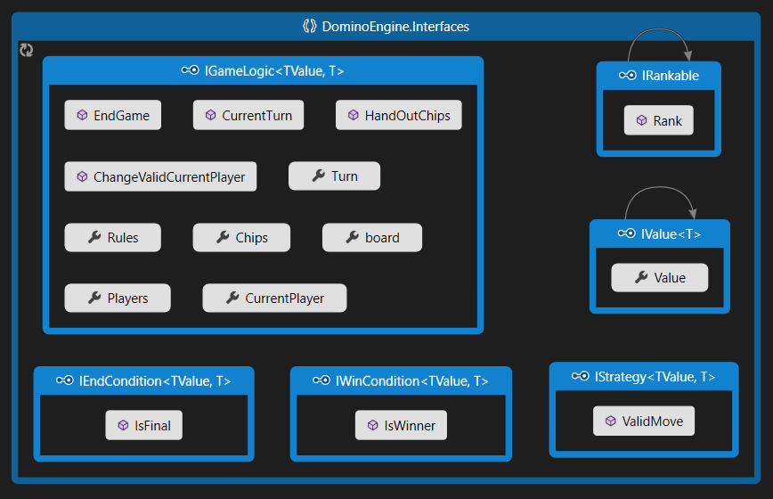
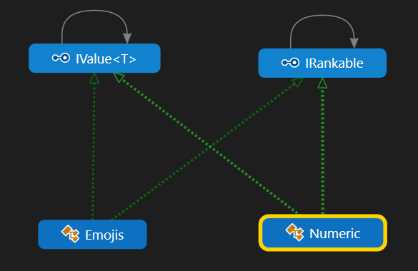
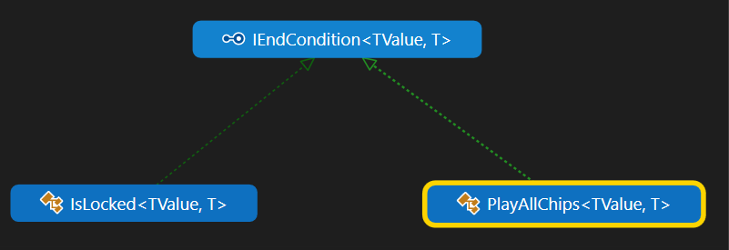
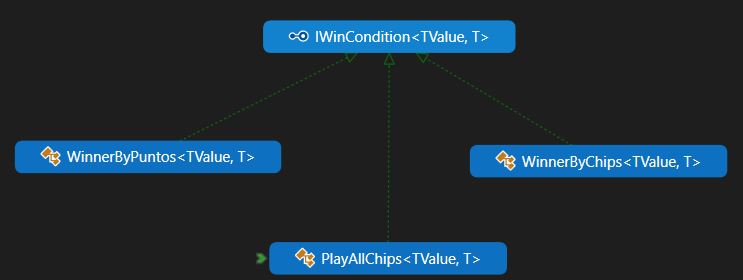
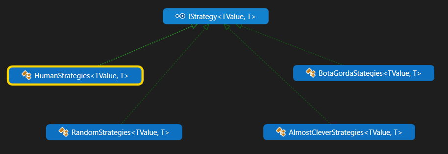
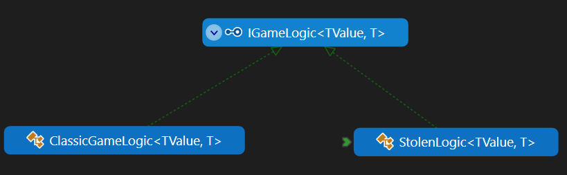

# Second Project Dominoes

***Proyecto de Programación II. Facultad de Matemática y Computación. Universidad de La Habana. Curso 2021.***

Dominoes es una aplicación que permite jugar Dominoes contra una serie de "inteligencias" **lo original** de esta aplicación es que hemos tratado de crear código  cumplinendo con los principios SOLID de manera que implementar una nueva variante de domino o una nueva inteligencia requiera de la menor cantidad de cambios posibles, volvindolo extensible.

Es una aplicación de Consola, desarrollada con tecnología .NET Core 6.0 y en el lenguaje C#.

La aplicación está dividida en dos componentes fundamentales:

- `VisualDominoes` es un aplicación de consola que renderiza la interfaz gráfica y sirve los resultados.
- `DominoEngine` es una biblioteca de clases donde está implementada lo necesario para la lógica del del juego.

## Variaciones 
Pedemos variar las condiciones para ganar,
la formas de finalizar el juego, Como se desarrollan las logicas de un juegos esto incluye como transcure un turno como reparten las fichas
las strtegias o formas,en las que juegan los players,la forma en la que se generan las fichas del juego,la forma en la que se reparten las fichas a cada jugador, entre otros aspectos

# Implementaciones de tipos de domino 
Implementamos tres variates de domino dos con logicas clasicas y uno con una logica distinta las logicas clasicas son aquellas en las que los juegos tienen un comportamineto ordinario como el domino clasico y la logica distinta una logica creada especialmente para jugar al robaito esto debidio a que en este juego los turnos se dearrollan de formas diferentes o sea no terminan hata que el jugador no para de robar,

# Implementacion de estrategias
Inplementamos una forma de juego para el usuario,
un jugador que devuelve la ficha que mas rackin tiene,Uno que juega de forma aleatoria y otro que trata de buscar una forma que creemos que puede ser optima

# **Sobre la Implemetacion**
> Interfaces implementadas para modelar los aspectos variables del juego

>IValue e IRankable fueron creadas con el objetivo de construir un objeto que formara parte de las ficha constituye una de las caras de esta.hacer variar, cuando variamos el valor podemos tener fichas de figuras :balloon: ,colores 🔴,números 1️⃣ etc...

> Implemetamos dos clases que heredan de IEndConditions una es el criterio de finalizcion todos los jugadores pasados o juego trancado y la otra es todas las fichas jugadas esto nos permitio modelar las reglas de los juegos

> Implemetamos clases que heredan de IWinConditions una es el criterio de ganador por puntos ganador por cantidad de fichas y ganador por todas jugadas esto nos permitio mas libertades a la hora de conformar las reglas del juego

>Las clases que heredan de IStrategy nos da una jugada dependiendo de criterios y formas de jugar al domino

> Estas clases no heredan de otas puesto que no nos vimos en la necesida de variar estas estructuras en su totalidad

> Representa las logicas de los juegos y son modeladas usando las clases anteriores

# Posibles mejoras a deficiencias 
- Como posibles mejoras esta la optimización e implementación de mas variantes de juegos.

- Reajustar el funcionamiento y aumentar la abstracción par implementar juegos mas potentes.

- Implementar un jugador de domino mas inteligente que los actuales.

- Implementar una interfaz gráfica. 

